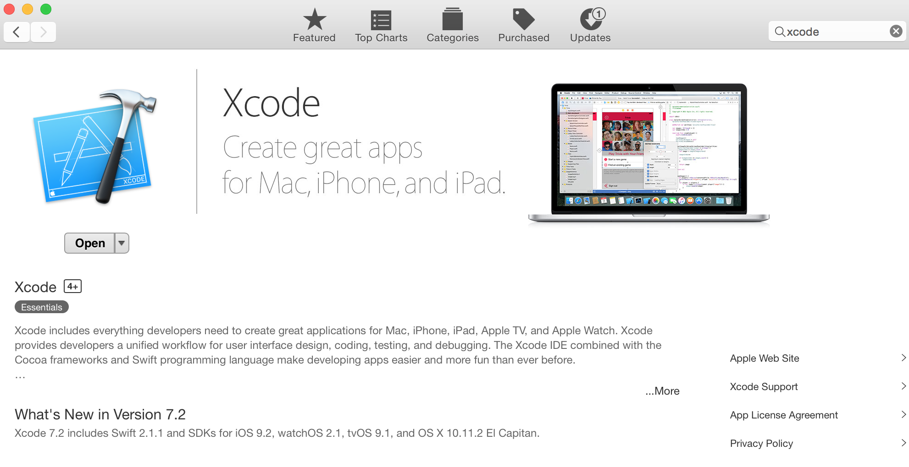
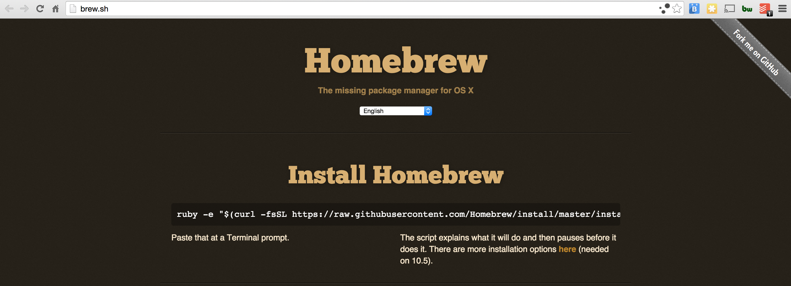

# 1. Setup Developer Environment
In this unit, you'll install all the tools required to build a complex React Native app. You'll install quiet a lot of tools but the good news is that it's just one time setup. And after that, you'll be able to build complex Native apps using mainly React and JavaScript knowledge.

## Step 1: Install Xcode

1. Go to Apple's developer site and <a href="https://developer.apple.com/xcode/download/" target="_blank">Download Xcode</a>
2. Click on "View in the Map App Store" - This opens "App store" app on your mac.
3. Install it and then click `open` to open Xcode.

Note: Latest Xcode version is: 7.2




## Step 2: Install Node.js

React and React Native all need node.js. Install Node.js if you don't have it yet. 

1. Go to <a href="https://nodejs.org" target="_blank">nodejs.org</a> and install Node.js
2. Open Terminal, and type: `node -v`, you should see current Node version.
3. Now, type `npm -v`, you should see npm's(Node Package Manager) current version. 

	> `npm` is a command line tool that is installed as part of Node.js installation and is used to install various node.js libraries.
	
## Step 3: Install Homebrew
Homebrew is a popular repository for 1000s of OS X applications like Node.js, MongoDB, etc. React Native recommends installing several tools like `Watchman` and `Flow`. 

1. Open <a href="http://brew.sh/ target="_blank">Homebrew</a> website.
2. Follow instructions on the site to install it.
	
	```
	ruby -e "$(curl -fsSL https://raw.githubusercontent.com/Homebrew/install/master/install)"
	```
	



## Step 4: Install CocoaPods
<a href="https://cocoapods.org/" target="_blank"> CocoaPods</a> is a dependency manager for Objective-C and Swift projects. It's similar to 'npm' in the Node.js World. You may need this to install Native Objective-C or Swift libraries.

1. Open Terminal
2. Run: `sudo gem install cocoapods`	


## Step 5: Install Other CLI Tools
	
1. Open Terminal 
2. Install Watchman by running: `brew install watchman`
3. Install React Native CLI by running: `sudo npm install react-native-cli -g` 


	> <a href="https://facebook.github.io/watchman/" target="_blank">Watchman</a> file watching is used to by React Native to monitor development changes and instantly convert them to a Native app. 
	
	

## Additional Resources

- <a href="https://facebook.github.io/react-native/" target="_blank">React Native</a> Contains the everything you need to build React Native apps.


<div class="row" style="margin-top:40px;">
<div class="col-sm-12">
<a href="index.html" class="btn btn-default"><i class="glyphicon glyphicon-chevron-left"></i> Previous</a>
<a href="react-native-tutorial-create-forceios-app.html" class="btn btn-default pull-right">Next <i class="glyphicon glyphicon-chevron-right"></i></a>
</div>
</div>
